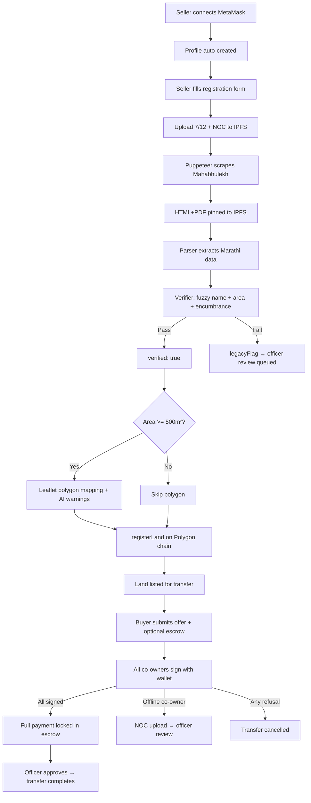
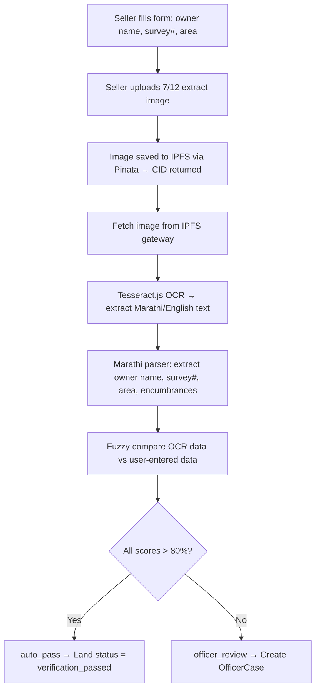

# Mahabhunaksha-to-Transfer Workflow — Implementation Plan (Final)

## Decisions Resolved

| Decision | Answer |
|----------|--------|
| Aadhaar/eKYC | **Optional** — stronger identity badge, not gating |
| Auth | **MetaMask wallet on Polygon** — SIWE, auto-create profile from wallet |
| Officers | **Pre-whitelisted externally** — 2-3 per tehsil, not self-registerable |
| Mahabhunaksha | **Puppeteer scrape** — HTML+PDF pinned to IPFS |
| AI boundary | **Advisory soft warnings** — SAM2/U-Net comparison, no blocking |
| Polygon mapping | **Skip under 500m²** — Leaflet + Bhuvan imagery for larger plots |

---

## Complete Workflow Specification

### 1. Onboarding
- User connects MetaMask wallet on Polygon
- Profile auto-created from wallet address
- Optional Aadhaar/eKYC for stronger identity
- Role detected: Seller, Buyer, or Officer
- Officers are pre-whitelisted externally (2-3 per tehsil)

### 2. Land Registration
- Seller fills form: district, taluka, village, survey number, owner names, area, encumbrances, boundaries
- Co-owners listed with shares + wallet addresses
- Offline co-owners: scanned 7/12 + signed NOC uploaded to IPFS

### 3. Ownership Verification
- Puppeteer scraper auto-fills Mahabhulekh v2.0 portal
- Full HTML + PDF captured and pinned to IPFS (tamper-proof)
- Parser extracts khatedar names, area, encumbrances from Marathi page
- Verifier runs: fuzzy name match, area tolerance, encumbrance flagging
- Pass → `verified: true`
- Fail → `legacyFlag: true`, manual 7/12 upload required, officer review queued

### 4. Polygon Mapping
- Plots under 500m² skip this step
- Larger plots: Leaflet map with Bhuvan satellite imagery
- Seller draws boundary polygon
- AI (SAM2/U-Net) compares drawn polygon vs satellite features
- Flags overlaps/mismatches as **soft warnings** only

### 5. On-Chain Registration
- `registerLand()` called on Polygon chain
- Stores: survey number, co-owners array, shares, area, encumbrances hash, polygon GeoJSON CID, raw scrape CID, verification status, spatial result, legacy flag, timestamp

### 6. Transfer Request
- Buyer searches listings, views land details (encumbrances, spatial notes)
- Submits transfer request with offer price
- Optional small escrow deposit signals intent
- All co-owners notified on-chain + email/SMS

### 7. Co-Owner Acceptance
- Every connected co-owner must individually sign with wallet (smart contract enforced)
- Offline co-owners: fresh NOC PDF uploaded to IPFS → auto-flags for mandatory officer review
- Any refusal → cancels entire request
- All sign → buyer locks full payment into escrow

---

## Core Flow Diagram



## OCR Comparison Flow (IPFS → Extract → Compare)



---

## Phase 1: Foundation — Models, Utils, Middleware

### Models

#### [MODIFY] [User.model.js](file:///Users/chirayumarathe/Documents/Land-Registry-System/land-registry-backend/src/models/User.model.js)
```js
{
  walletAddress: { type: String, unique: true, required: true, lowercase: true },
  role: { type: String, enum: ['seller', 'buyer', 'officer', 'admin'], required: true },
  profile: {
    fullName: String,
    aadhaarHash: String,       // optional KYC — SHA-256 of Aadhaar number
    phone: String,
    email: String,
    kycVerified: { type: Boolean, default: false }
  },
  nonce: String,               // for SIWE challenge
  isActive: { type: Boolean, default: true },
  // Officer-specific
  officerMeta: {
    tehsil: String,
    whitelistedBy: String,     // admin wallet who whitelisted
    whitelistedAt: Date
  },
  createdAt: { type: Date, default: Date.now }
}
```

#### [MODIFY] [Land.model.js](file:///Users/chirayumarathe/Documents/Land-Registry-System/land-registry-backend/src/models/Land.model.js)
```js
{
  owner: { type: ObjectId, ref: 'User', required: true },
  coOwners: [{ type: ObjectId, ref: 'CoOwner' }],
  location: {
    district: String, districtValue: String,
    taluka: String, talukaValue: String,
    village: String, villageValue: String,
    surveyNumber: String, gatNumber: String,
  },
  area: { value: Number, unit: { type: String, enum: ['sqm', 'hectare', 'acre'], default: 'sqm' } },
  encumbrances: String,
  boundaryDescription: String,
  status: {
    type: String,
    enum: ['draft', 'documents_uploaded', 'verification_pending', 'verification_passed',
           'verification_failed', 'officer_review', 'registered', 'listed',
           'transfer_pending', 'transferred'],
    default: 'draft'
  },
  documents: {
    sevenTwelveCID: String,
    mahabhulekhSnapshotCID: String,
    mahabhunakshaSnapshotCID: String,
    nocDocuments: [{ coOwnerId: { type: ObjectId }, cid: String }],
    polygonGeoJsonCID: String,
  },
  verificationResult: { type: ObjectId, ref: 'VerificationResult' },
  legacyFlag: { type: Boolean, default: false },
  onChainTokenId: String,
  registrationTxHash: String,
  createdAt: { type: Date, default: Date.now },
  updatedAt: { type: Date, default: Date.now }
}
```

#### [MODIFY] [CoOwner.model.js](file:///Users/chirayumarathe/Documents/Land-Registry-System/land-registry-backend/src/models/CoOwner.model.js)
```js
{
  land: { type: ObjectId, ref: 'Land', required: true },
  user: { type: ObjectId, ref: 'User' },           // null if offline
  fullName: { type: String, required: true },
  walletAddress: String,                             // null if offline
  sharePercent: { type: Number, required: true },
  isOnline: { type: Boolean, default: true },
  nocStatus: { type: String, enum: ['pending', 'signed', 'rejected', 'offline_uploaded'], default: 'pending' },
  nocSignature: String,
  nocDocumentCID: String,
  signedAt: Date,
}
```

#### [MODIFY] [TransferRequest.model.js](file:///Users/chirayumarathe/Documents/Land-Registry-System/land-registry-backend/src/models/TransferRequest.model.js)
```js
{
  land: { type: ObjectId, ref: 'Land', required: true },
  seller: { type: ObjectId, ref: 'User', required: true },
  buyer: { type: ObjectId, ref: 'User', required: true },
  price: { amount: Number, currency: { type: String, default: 'POL' } },
  status: {
    type: String,
    enum: ['offer_sent', 'offer_accepted', 'coowner_consent_pending', 'officer_review',
           'escrow_locked', 'approved', 'completed', 'rejected', 'cancelled'],
    default: 'offer_sent'
  },
  coOwnerConsents: [{
    coOwner: { type: ObjectId, ref: 'CoOwner' },
    status: { type: String, enum: ['pending', 'approved', 'rejected'], default: 'pending' },
    signedAt: Date
  }],
  officerCase: { type: ObjectId, ref: 'OfficerCase' },
  escrow: {
    contractAddress: String, txHash: String,
    lockedAmount: Number,
    status: { type: String, enum: ['none', 'intent_deposit', 'locked', 'released', 'refunded'], default: 'none' }
  },
  transferTxHash: String,
  createdAt: { type: Date, default: Date.now },
  updatedAt: { type: Date, default: Date.now }
}
```

#### [MODIFY] [OfficerCase.model.js](file:///Users/chirayumarathe/Documents/Land-Registry-System/land-registry-backend/src/models/OfficerCase.model.js)
```js
{
  land: { type: ObjectId, ref: 'Land', required: true },
  transferRequest: { type: ObjectId, ref: 'TransferRequest' },
  assignedOfficer: { type: ObjectId, ref: 'User' },
  type: { type: String, enum: ['verification_review', 'transfer_review', 'dispute'], required: true },
  status: { type: String, enum: ['queued', 'in_review', 'approved', 'rejected', 'escalated'], default: 'queued' },
  findings: String,
  signatures: [{ type: ObjectId, ref: 'OfficerSignature' }],
  createdAt: { type: Date, default: Date.now },
  resolvedAt: Date
}
```

#### [MODIFY] [VerificationResult.model.js](file:///Users/chirayumarathe/Documents/Land-Registry-System/land-registry-backend/src/models/VerificationResult.model.js)
```js
{
  land: { type: ObjectId, ref: 'Land', required: true },
  source: { type: String, enum: ['mahabhulekh', 'mahabhunaksha', 'manual_upload'], required: true },
  userInput: {
    ownerName: String, surveyNumber: String,
    area: Number, areaUnit: String,
    district: String, taluka: String, village: String,
  },
  ocrExtracted: {
    ownerName: String, surveyNumber: String,
    area: Number, areaUnit: String,
    rawText: String,
  },
  scrapedData: {            // from Mahabhulekh HTML
    owners: [String], area: String, encumbrances: String,
  },
  comparison: {
    nameMatch: { score: Number, passed: Boolean },
    surveyMatch: { score: Number, passed: Boolean },
    areaMatch: { score: Number, passed: Boolean, tolerance: Number },
    encumbranceFlag: Boolean,
    overallScore: Number,
    verdict: { type: String, enum: ['auto_pass', 'auto_fail', 'officer_review'] },
  },
  cids: { htmlCID: String, pdfCID: String, imageCID: String, ocrResultCID: String },
  createdAt: { type: Date, default: Date.now }
}
```

#### [MODIFY] [Polygon.model.js](file:///Users/chirayumarathe/Documents/Land-Registry-System/land-registry-backend/src/models/Polygon.model.js)
```js
{
  land: { type: ObjectId, ref: 'Land', required: true },
  geoJson: { type: Object, required: true },
  areaSqm: Number,
  source: { type: String, enum: ['user_drawn', 'bhuvan_import', 'mahabhunaksha'] },
  ipfsCID: String,
  warnings: [{
    type: { type: String, enum: ['overlap', 'area_mismatch', 'boundary_irregular'] },
    severity: { type: String, enum: ['info', 'warning', 'critical'] },
    message: String, data: Object
  }],
  skipped: { type: Boolean, default: false },
  createdAt: { type: Date, default: Date.now }
}
```

#### [MODIFY] [Notification.model.js](file:///Users/chirayumarathe/Documents/Land-Registry-System/land-registry-backend/src/models/Notification.model.js)
```js
{
  user: { type: ObjectId, ref: 'User', required: true },
  type: { type: String, enum: ['verification_complete', 'transfer_offer', 'noc_request',
          'officer_assigned', 'escrow_locked', 'transfer_complete', 'warning'] },
  title: String, message: String, metadata: Object,
  read: { type: Boolean, default: false },
  createdAt: { type: Date, default: Date.now }
}
```

#### [MODIFY] [OfficerSignature.model.js](file:///Users/chirayumarathe/Documents/Land-Registry-System/land-registry-backend/src/models/OfficerSignature.model.js)
```js
{
  officerCase: { type: ObjectId, ref: 'OfficerCase', required: true },
  officer: { type: ObjectId, ref: 'User', required: true },
  decision: { type: String, enum: ['approve', 'reject'], required: true },
  justification: String, signatureHash: String, txHash: String,
  signedAt: { type: Date, default: Date.now }
}
```

#### [MODIFY] [ConsentRecord.model.js](file:///Users/chirayumarathe/Documents/Land-Registry-System/land-registry-backend/src/models/ConsentRecord.model.js)
```js
{
  coOwner: { type: ObjectId, ref: 'CoOwner', required: true },
  transferRequest: { type: ObjectId, ref: 'TransferRequest', required: true },
  status: { type: String, enum: ['pending', 'approved', 'rejected'], default: 'pending' },
  signatureHash: String, ipfsCID: String, signedAt: Date
}
```

#### [MODIFY] [AuditLog.model.js](file:///Users/chirayumarathe/Documents/Land-Registry-System/land-registry-backend/src/models/AuditLog.model.js)
```js
{
  actor: { type: ObjectId, ref: 'User' },
  action: String, target: String, details: Object, ipAddress: String,
  createdAt: { type: Date, default: Date.now }
}
```

---

### Utilities

#### [MODIFY] [asyncHandler.js](file:///Users/chirayumarathe/Documents/Land-Registry-System/land-registry-backend/src/utils/asyncHandler.js)
Wrap async route handlers to catch errors without try-catch.

#### [MODIFY] [hashData.js](file:///Users/chirayumarathe/Documents/Land-Registry-System/land-registry-backend/src/utils/hashData.js)
SHA-256 hashing for Aadhaar masking and document integrity.

#### [MODIFY] [walletUtils.js](file:///Users/chirayumarathe/Documents/Land-Registry-System/land-registry-backend/src/utils/walletUtils.js)
EIP-4361 SIWE message builder, nonce generator, signature verifier (ethers.js).

#### [MODIFY] [areaConvert.js](file:///Users/chirayumarathe/Documents/Land-Registry-System/land-registry-backend/src/utils/areaConvert.js)
Bi-directional conversion: sqm ↔ hectare ↔ acre ↔ guntha (Maharashtra unit).

#### [MODIFY] [logger.js](file:///Users/chirayumarathe/Documents/Land-Registry-System/land-registry-backend/src/utils/logger.js)
Structured JSON logger (winston) with log levels.

#### [MODIFY] [paginateQuery.js](file:///Users/chirayumarathe/Documents/Land-Registry-System/land-registry-backend/src/utils/paginateQuery.js)
Mongoose paginator: `page`, `limit`, `sort`, `total`.

#### [MODIFY] [fuzzyMatch.js](file:///Users/chirayumarathe/Documents/Land-Registry-System/land-registry-backend/src/utils/fuzzyMatch.js)
Levenshtein distance + Marathi Unicode normalization for name matching.

---

### Middleware

#### [MODIFY] [auth.middleware.js](file:///Users/chirayumarathe/Documents/Land-Registry-System/land-registry-backend/src/middleware/auth.middleware.js)
JWT verification, extract wallet, attach `req.user`.

#### [MODIFY] [role.middleware.js](file:///Users/chirayumarathe/Documents/Land-Registry-System/land-registry-backend/src/middleware/role.middleware.js)
`requireRole('seller', 'officer')` — checks `req.user.role`.

#### [MODIFY] [upload.middleware.js](file:///Users/chirayumarathe/Documents/Land-Registry-System/land-registry-backend/src/middleware/upload.middleware.js)
Multer: memory storage, 10MB limit, accept `image/*` + `application/pdf`.

#### [MODIFY] [validate.middleware.js](file:///Users/chirayumarathe/Documents/Land-Registry-System/land-registry-backend/src/middleware/validate.middleware.js)
Joi schema validator middleware factory.

#### [MODIFY] [errorHandler.middleware.js](file:///Users/chirayumarathe/Documents/Land-Registry-System/land-registry-backend/src/middleware/errorHandler.middleware.js)
Global error handler with structured JSON responses.

#### [MODIFY] [rateLimit.middleware.js](file:///Users/chirayumarathe/Documents/Land-Registry-System/land-registry-backend/src/middleware/rateLimit.middleware.js)
Express rate limiter (per-IP and per-wallet).

---

## Phase 2: Auth & Onboarding

#### [MODIFY] [auth.controller.js](file:///Users/chirayumarathe/Documents/Land-Registry-System/land-registry-backend/src/controllers/auth.controller.js)
- `POST /auth/nonce` — generate nonce for wallet
- `POST /auth/verify` — verify SIWE signature, issue JWT, auto-create profile
- `POST /auth/register` — create user with role selection
- `GET /auth/me` — current user from JWT

#### [MODIFY] [profile.controller.js](file:///Users/chirayumarathe/Documents/Land-Registry-System/land-registry-backend/src/controllers/profile.controller.js)
- `GET /profile` — get profile
- `PUT /profile` — update name, phone, email
- `POST /profile/kyc` — submit Aadhaar hash (optional)

#### [MODIFY] [nonce.service.js](file:///Users/chirayumarathe/Documents/Land-Registry-System/land-registry-backend/src/services/auth/nonce.service.js)
Generate + store nonce in Redis (TTL 5min).

#### [MODIFY] [signature.service.js](file:///Users/chirayumarathe/Documents/Land-Registry-System/land-registry-backend/src/services/auth/signature.service.js)
Verify EIP-4361 SIWE signatures, issue JWT.

---

## Phase 3: Land Registration + Co-Owners + IPFS/OCR

#### [MODIFY] [ipfs.controller.js](file:///Users/chirayumarathe/Documents/Land-Registry-System/land-registry-backend/src/controllers/ipfs.controller.js)
- `POST /ipfs/upload` — upload to IPFS, return CID
- `GET /ipfs/:cid` — fetch from gateway
- `POST /ipfs/extract-and-compare` — upload → IPFS → OCR → compare

#### [NEW] [ocr.service.js](file:///Users/chirayumarathe/Documents/Land-Registry-System/land-registry-backend/src/services/ipfs/ocr.service.js)
Tesseract.js with Marathi (mar) + English (eng) — extract text + parse fields.

#### [NEW] [compare.service.js](file:///Users/chirayumarathe/Documents/Land-Registry-System/land-registry-backend/src/services/ipfs/compare.service.js)
Compare user-entered vs OCR-extracted data, return per-field scores + verdict.

#### [MODIFY] [land.controller.js](file:///Users/chirayumarathe/Documents/Land-Registry-System/land-registry-backend/src/controllers/land.controller.js)
- `POST /land/register` — create Land in draft
- `POST /land/:id/upload-documents` — upload 7/12, trigger OCR
- `GET /land` — list user's lands
- `GET /land/:id` — land details + verification
- `PUT /land/:id` — update draft

#### [MODIFY] [coowner.controller.js](file:///Users/chirayumarathe/Documents/Land-Registry-System/land-registry-backend/src/controllers/coowner.controller.js)
- `POST /land/:id/coowners` — add co-owner
- `POST /land/:id/coowners/:coOwnerId/noc` — upload offline NOC
- `GET /land/:id/coowners` — list with NOC status
- `PUT /land/:id/coowners/:coOwnerId/sign` — wallet sign NOC

---

## Phase 4: Verification Engine

#### [MODIFY] [verification.controller.js](file:///Users/chirayumarathe/Documents/Land-Registry-System/land-registry-backend/src/controllers/verification.controller.js)
- `POST /verification/mahabhulekh` — existing scraper (keep working)
- `POST /verification/document-compare` — image → OCR → compare
- `GET /verification/:landId/result` — full result
- `POST /verification/:landId/retry` — retry failed

#### [MODIFY] [parser.service.js](file:///Users/chirayumarathe/Documents/Land-Registry-System/land-registry-backend/src/services/mahabhulekh/parser.service.js)
Parse real Mahabhulekh HTML: `gvOwnerDetails` table, Marathi labels (क्षेत्र, खाता).

#### [MODIFY] [verifier.service.js](file:///Users/chirayumarathe/Documents/Land-Registry-System/land-registry-backend/src/services/mahabhulekh/verifier.service.js)
Levenshtein fuzzy match, configurable thresholds, multi-owner, structured verdict.

---

## Phase 5: Polygon Mapping

#### [MODIFY] [polygon.controller.js](file:///Users/chirayumarathe/Documents/Land-Registry-System/land-registry-backend/src/controllers/polygon.controller.js)
- `POST /land/:id/polygon` — save GeoJSON
- `GET /land/:id/polygon` — get polygon
- `POST /land/:id/polygon/validate` — spatial checks
- Skip if `area < 500 sqm`, compute area via Turf.js, overlap advisory warnings

#### [MODIFY] [geojson.service.js](file:///Users/chirayumarathe/Documents/Land-Registry-System/land-registry-backend/src/services/spatial/geojson.service.js)
GeoJSON validation + area computation using `@turf/area`.

---

## Phase 6: On-Chain + Transfer + Escrow

#### [MODIFY] [officer.controller.js](file:///Users/chirayumarathe/Documents/Land-Registry-System/land-registry-backend/src/controllers/officer.controller.js)
- `GET /officer/cases` — list queued cases
- `GET /officer/cases/:id` — case details
- `POST /officer/cases/:id/approve` — approve
- `POST /officer/cases/:id/reject` — reject

#### [MODIFY] [transfer.controller.js](file:///Users/chirayumarathe/Documents/Land-Registry-System/land-registry-backend/src/controllers/transfer.controller.js)
- `POST /transfer/offer` — buyer sends offer
- `POST /transfer/:id/accept` — seller accepts
- `POST /transfer/:id/reject` — seller rejects
- `GET /transfer/my` — user's transfers
- `POST /transfer/:id/coowner-consent` — co-owner signs
- `POST /transfer/:id/finalize` — trigger on-chain after all approvals

#### [MODIFY] [escrow.controller.js](file:///Users/chirayumarathe/Documents/Land-Registry-System/land-registry-backend/src/controllers/escrow.controller.js)
- `POST /escrow/lock` — lock funds (intent deposit or full)
- `POST /escrow/:id/release` — release to seller
- `POST /escrow/:id/refund` — refund to buyer
- `GET /escrow/:id/status` — check status

#### [MODIFY] [notification.controller.js](file:///Users/chirayumarathe/Documents/Land-Registry-System/land-registry-backend/src/controllers/notification.controller.js)
- `GET /notifications` — user's notifications
- `PUT /notifications/:id/read` — mark read
- `PUT /notifications/read-all`

#### Blockchain Services (stubs until contracts deployed)
- [contract.service.js](file:///Users/chirayumarathe/Documents/Land-Registry-System/land-registry-backend/src/services/blockchain/contract.service.js) — ethers.js contract factory
- [land.service.js](file:///Users/chirayumarathe/Documents/Land-Registry-System/land-registry-backend/src/services/blockchain/land.service.js) — `registerLand()`
- [transfer.service.js](file:///Users/chirayumarathe/Documents/Land-Registry-System/land-registry-backend/src/services/blockchain/transfer.service.js) — `initiateTransfer()`, `approveTransfer()`
- [escrow.service.js](file:///Users/chirayumarathe/Documents/Land-Registry-System/land-registry-backend/src/services/blockchain/escrow.service.js) — `lockFunds()`, `releaseFunds()`
- [multisig.service.js](file:///Users/chirayumarathe/Documents/Land-Registry-System/land-registry-backend/src/services/blockchain/multisig.service.js) — `submitSignature()`, `checkThreshold()`

---

## New Dependencies (installed)
```
tesseract.js, ethers, jsonwebtoken, siwe, @turf/area, @turf/boolean-overlap,
joi, winston, fastest-levenshtein, cors, helmet
```

---

## Verification Plan

### Per-Phase Smoke Tests
- Phase 1: `node -e "require('./src/models/Land.model')"` for all models
- Phase 2: `curl POST /api/v1/auth/nonce` + `/auth/verify`
- Phase 3: `curl POST /api/v1/ipfs/extract-and-compare` with test 7/12 image
- Phase 4: `curl POST /api/v1/verification/verify` end-to-end
- Phase 5: `curl POST /api/v1/land/:id/polygon` with GeoJSON
- Phase 6: Full transfer flow via API calls

### Manual Verification
- Upload real 7/12 extract image → verify OCR extracts Marathi text
- Compare OCR output against manually typed form fields
- Test fuzzy matching with slight misspellings in Marathi names
- Verify IPFS CIDs are accessible via Pinata gateway
